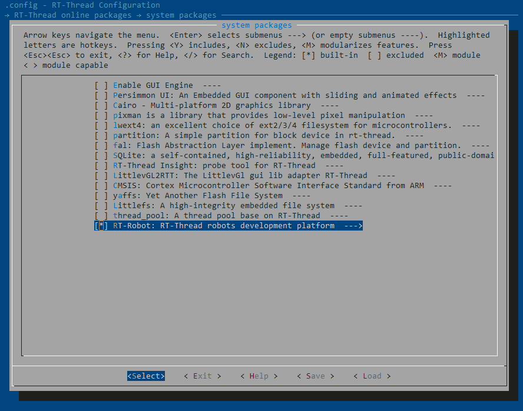

## RT-Robot

## 1、介绍

RT-Robot 是 RT-Thread 的机器人框架，希望能够支持智能小车、机械臂、飞控等各种不同类型的机器人。

当前以智能车为主要目标，希望支持两轮差分驱动、四轮差分驱动、麦克纳姆轮驱动、经典 Ackerman (两轮差分，一方向连杆) 的小车底盘。

### 1.1 目录结构

`rt-robot` 软件包目录结构如下所示：

```
rt-robot
│
├─docs
│      design.md            // 模块设计文档
│      api.md               // API 说明文档
│      samples.md           // 框架应用示例
│
├─controller
│      controller.c         // 抽象控制器组件
│      controller.h
│      ps2_controller.c     // PS2 手柄模块
│      ps2_controller.h
│
├─robot
│      robot.c              // 抽象机器人组件
│      robot.h
│      mobile_robot.c       // 小车机器人模块
│      mobile_robot.h
│
├─chassis
│      chassis.c            // 小车底盘组件
│      chassis.h
│
├─kinematics
│      kinematics.c         // 小车动力学模型组件
│      kinematics.h
│
├─wheel
│      wheel.c              // 小车车轮组件
│      wheel.h
│
├─encoder
│      encoder.c            // 车轮编码器组件
│      encoder.h
│
├─motor
│      motor.c              // 车轮电机组件
│      motor.h
│      dc_motor.c           // 直流电机模块
│      dc_motor.h
│
├─pid
│      pid.c                // 车轮 PID 组件
│      pid.h
│
├─README.md                 // 软件包使用说明
│
└─SConscript                // RT-Thread 默认的构建脚本
```

### 1.2 依赖

- RT-Thread 3.1.x +

## 2、获取软件包

使用 `rt-robot` 软件包需要在 BSP 目录下使用 menuconfig 命令打开 Env 配置界面，在 `RT-Thread online packages → system packages` 中选择 RT-Robot 软件包，操作界面如下图所示：

[](https://github.com/RT-Thread-packages/paho-mqtt/blob/master/docs/figures/select_mqtt_package.png)

选择合适的配置项后，使用 `pkgs --update` 命令下载软件包并添加到工程中即可。

## 3、使用 rt-robot

- 框架设计说明，请参考 [设计手册](docs/design.md)。
- 完整的 API 文档，请参考 [API 手册](docs/api.md)。
- 详细的示例介绍，请参考 [示例文档](docs/samples.md) 。

## 4、注意事项

- 当前框架正在逐步实现，各种类型的小车还在一步步测试，欢迎大家提 PR 一起完善


## 5、联系方式 & 感谢

- 维护：RT-Thread 开发团队
- 主页：https://github.com/RT-Thread-packages/rt-robot