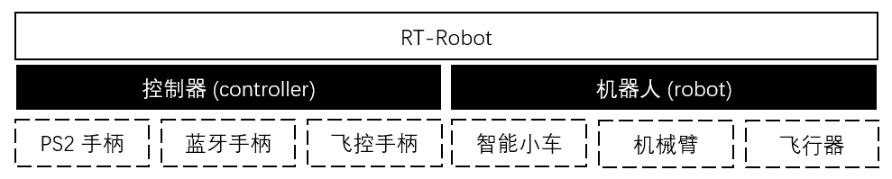
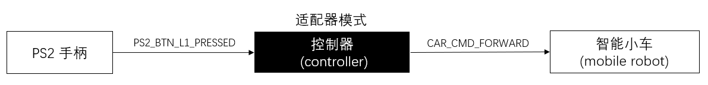
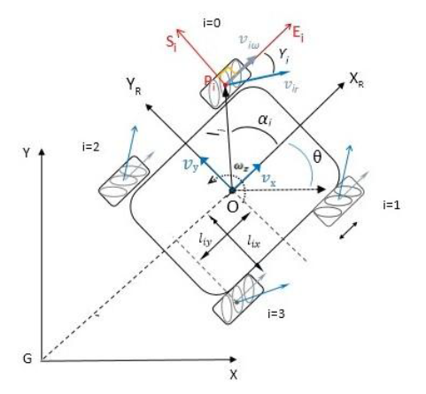

# RT-Robot 设计说明

## 顶层框架设计

这个框架的顶层模块当前有 controller 和 robot，通过 controller 接收和发送指令来控制 robot。

- robot 是抽象出的机器人模块，为了适配智能小车、机械臂、飞控等各种不同类型的机器人。

- controller 是抽象出的控制器模块，可以适配 PS2 手柄、蓝牙手柄、飞控手柄等不同类型的控制器。

### 1 控制器模块 (controller) 

控制器对机器人做出控制的流程是一个适配器模式。例如， PS2 手柄控制智能小车的流程：

- PS2 手柄模块内会用 enum 维护自己的按键值，例如 PS2_BTN_L1_PRESSED 表示 L1 被按下

- 智能小车模块内也会有自己的控制指令，例如 CAR_CMD_FORWARD 表示控制小车向前运动

那么 PS2 手柄的按键值是怎么对应到小车的运动呢？这需要在初始化的时候通过控制器的 bind 函数，将手柄的按键值和小车的运动关联起来，例如将 PS2_BTN_L1_PRESSED 和 CAR_CMD_FORWARD 关联起来，当 PS2 手柄的 L1 按键被按下后，我们就可以知道应当控制小车向前运动。

因此，控制器模块在此处起到一个适配器的作用，将手柄的按键值转换为小车的运动，其实也就是初始化的时候起到定义自己喜欢的按键功能的作用。

### 2 机器人模块 (robot) 

我们下面以智能小车 (mobile robot) 为例，小车模块当前主要分为车底盘 (chassis) 和传感器 (sensor)，例如一个智能小车会包含两轮差分驱动底盘，和一些陀螺仪加速度计等传感器，整体框架图如下图所示。

#### 2.1 车底盘模块 (chassis)

车底盘模块的作用在于定义小车的底盘类型，例如有多少个可以控制的轮子、小车的长宽等物理属性、运动学模型。例如两轮的车底盘搭配两轮差分动力学模型，我们就得到了两轮差分驱动的小车。

车底盘模块下面又包括车轮 (wheel) 模块和动力学模型模块 (kinematics)。

##### 2.1.1 车轮模块 (wheel)

车轮模块需要实现一个能够闭环控制的车轮，因此需要用到电机、编码器和 PID算法。

###### 2.1.1.1 电机模块 (motor)

电机模块需要为不同电机提供统一的接口，能够实现闭环电机转速控制，包括：

- 直流电机
- 舵机

- 步进电机
- CAN电机
- 直流无刷电机

###### 2.1.1.2 编码器模块 (encoder)

编码器模块需要为不同编码器提供统一的接口，能够测量得到当前电机的转速、运动方向等，包括：

- 单相编码器
- AB相编码器

###### 2.1.1.3 PID 模块 (PID)

PID模块需要利用当前编码器测得的转速，和目标设定值，实现对电机的闭环控制，包括：

- 增量式PID

##### 2.1.2 动力学模型模块 (kinematics)

动力学模块包含各种小车物理学模型，需要实现小车运动速度 (Vx, Vy, w) 与不同电机转速 (rpm1, rpm2, rpm3, rpm4) 之间的双向切换，包括：

- 两轮差分驱动

- 四轮差分驱动

- 麦克纳姆轮驱动

- Ackerman模型

当前我们的小车坐标系定义如下：

除了全局坐标系外，我们定义了小车的前进方向为 Xr，与前进方向垂直的方向为 Yr，以小车车头逆时针旋转方向为旋转角速度 w 的正方向。

#### 2.2 传感器模块 (sensor)

Coming soon