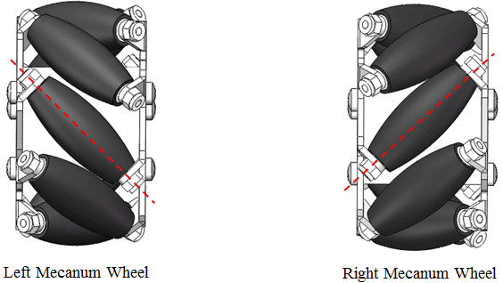
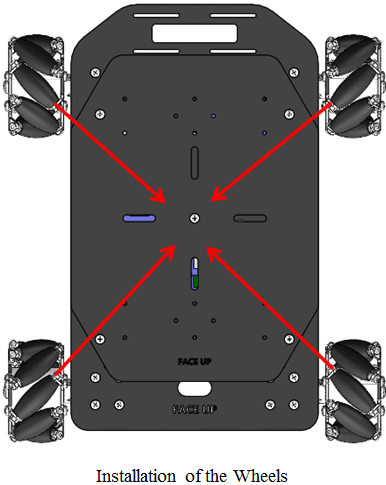
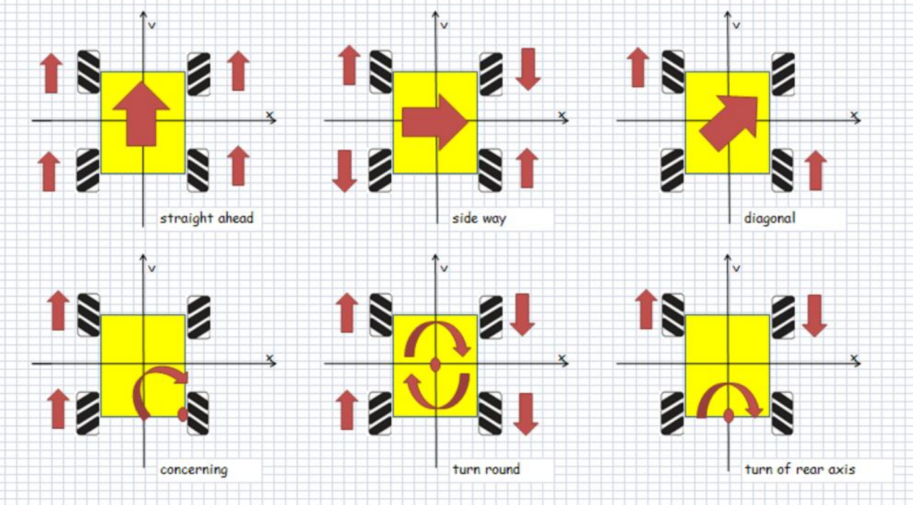

# RT-Robot 详细介绍

**RT-Robot 是 RT-Thread 的机器人框架，希望能够支持智能小车、机械臂、无人机等各种不同类型的机器人。**

## 软件包目录结构
```shell
.
|-- README.md                       // 说明
|-- SConscript                      // 构建脚本
|-- chassis                         // 底盘模块
|-- controller                      // 控制器模块
|-- docs                            // 文档
|-- encoder                         // 编码器模块
|-- kinematics                      // 动力学模型模块
|-- motor                           // 电机模块
|-- protocol                        // 协议模块（上位机/遥控器）
`-- wheel                           // 车轮模块
```

## 软件包功能特点

rt-robot 当前只支持智能小车，特点如下：

- 支持两轮差分驱动、四轮差分驱动、麦克纳姆轮驱动的小车底盘

- 支持增量、位置式 PID
- 支持单相、AB 相编码器
- 支持双 PWM、单 PWM 的直流电机驱动，支持驱动舵机
- 支持 PS2 遥控器
- 支持 ANO_TC 匿名科创地面站

## 小车动力学模型

为了控制小车运动，必然要建立运动学模型，rt-robot 当前支持以下模型：

- TWO_WD 两轮差分驱动

- FOUR_WD 四轮差分驱动
- MECANUM 麦克纳姆轮驱动
- ACKERMANN 后轮驱动调速，
前轮通过连杆控制方向

运动型机器人根据其物理学模型又包括 **Holonomic** 和 **Non-Holonomic** 。

**两轮差分驱动小车** 就是典型的Non-Holonomic，因为它的控制自由度(controllable degree of freedom)小于整体自由度(total degrees of freedom)，小车的整体自由度有3个，X,Y坐标的运动以及当前朝向(Orientation)，但是它的控制自由度只有2个：加速度和旋转角度。 **麦克纳姆轮驱动的小车** 则属与于Holonomic，它的控制自由度(controllable degree of freedom)等于整体自由度(total degrees of freedom)因为它可以在平面坐标系内沿任意方向移动。下面我们重点介绍麦克纳姆轮驱动的小车。

### 1 麦克纳姆轮驱动

麦克纳姆(Mecanum)轮驱动的小车属于Holonomic，它的特点在于小车可以保持车头方向不变，就在平面坐标系内沿各个方向自由移动。

我们首先了解一下麦克纳姆轮，其实它主要是在传统的轮子上增加了滚轮，这样传统车轮无法实现的横向移动就可以通过滚轮完成，而滚轮的安装方式有两种：左旋和右旋，如下图所示：



图1.1 麦克纳姆轮不同安装方式

通过合理搭配左旋和右旋的麦克纳姆轮，就可以实现不同的运动组合。 **组装时一定要确保四个轮子上滚轮的转动轴汇聚于底板中心** ，这样控制才不会出现漂移，后面的理论分析也都是基于这一假设的。



图1.2 麦克纳姆轮安装方式

通过速度分解控制四个轮子的转速，就可以实现不同方向的运动。



图1.3 麦克纳姆轮驱动小车运动分解
