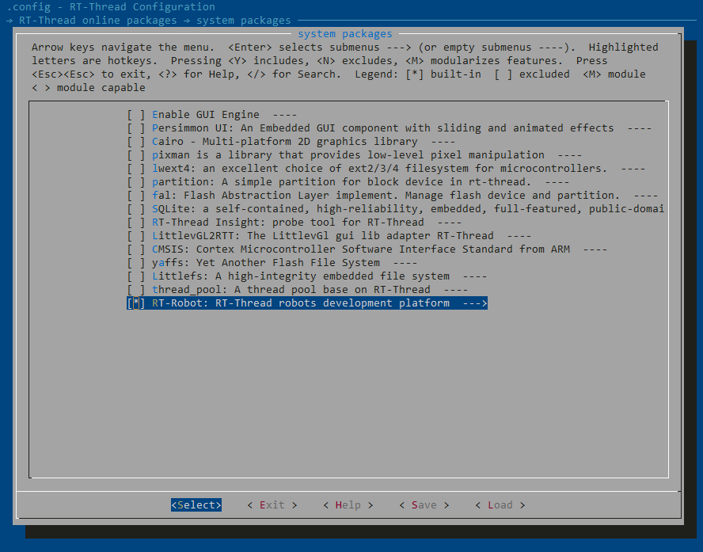

# RT-Robot 用户指南

本节主要介绍 rt-robot 框架的基本使用流程，并对重要的 API 和结构体进行说明。(组件思想)

## 准备工作

首先需要下载 rt-robot 软件包，并将软件包加入到项目中。在 BSP 目录下使用 menuconfig 命令打开 env 配置界面，在 RT-Thread online packages → system packages 中选择 RT-Robot 软件包，操作界面如下图所示：



```shell
RT-Thread online packages
    system packages  --->
         [*] RT-Robot: RT-Thread robots development platform  --->
            Version (latest) --->
```

Version: 配置软件包版本号。

选择完成后，使用 `pkgs --update` 命令下载软件包并更新用户配置。

## 使用流程

使用 rt-robot 框架的初始化智能车流程如下：

- 1 初始化车轮 (为车轮添加电机、编码器、控制器)
  - 1.1 初始化车轮电机 
  - 1.2 初始化车轮编码器
  - 1.3 初始化车轮控制器

- 2 初始化动力学模型

- 3 初始化车底盘 (为底盘添加车轮、动力学模型)

- 4 底盘控制

### 1 初始化车轮

车轮由电机、编码器、控制器三个组件组成。首先需要创建它们，然后再组成车轮。

#### 电机

电机有许多的类型和驱动方式，rt-robot 对此进行了抽象并针对不同类型和驱动方式的电机给出了各自的创建接口。用户调用对应的接口就可以创建出对应的电机对象。相应的创建API请参考 [api.md](./api.md)

#### 编码器

编码器有单相和AB相之分，rt-robot 对此给出了不同的创建接口，用户调用对应的接口就可以创建出对应的编码器对象。相应的创建API请参考 [api.md](./api.md)

#### 控制器

控制器本质上来说是一种算法，用来稳定系统输出（在此为车轮速度）。常见的控制算法为PID，其有增量式和位置式之分，rt-robot 对此有不同的创建接口。用户调用对应的接口就可以创建出对应的控制器对象。相应的创建API请参考 [api.md](./api.md)

#### 创建车轮

每个车轮都是由电机、编码器、控制器三个组件组成。在完成组件创建拿到组件对象后就可以调用如下接口创建车轮了。

_创建接口：_
```C
wheel_t     wheel_create(motor_t w_motor, encoder_t w_encoder, controller_t w_controller, float radius, rt_uint16_t gear_ratio);
```
- w_motor 电机对象
- w_encoder 编码器对象
- w_controller 控制器对象
- radius 车轮直径
- gear_ratio 减速比

此只是创建一个车轮，多个车轮需要多次创建

### 2 初始化动力学模型

"凡系统必有结构，系统结构决定系统功能"。
虽然小车的物理结构各不相同，但是同样作为小车底板，都能实现相同或相似的运动，
因此我们对小车的常见运动进行抽象，提供统一的接口，适配不同小车底板。不同车底
板最主要的区别在于物理模型，例如两轮驱动、四轮驱动等
。对此 rt-robot 有相应的动力学模型。现抽象出的动力学模型有以下四种类型：
- TWO_WD 两轮差分驱动
- FOUR_WD 四轮差分驱动
- MECANUM 麦克纳姆轮驱动
- ACKERMANN 后轮驱动调速，
前轮通过连杆控制方向

_创建接口：_
```C
kinematics_t    kinematics_create(enum base k_base, float length_x, float length_y, float wheel_radius);
```
- k_base 类型
- length_x X轴两车轮间距（单位: m）
- length_y Y轴两车轮间距（单位: m）
- wheel_radius  车轮直径（单位：m）

### 3 初始化车底盘

在创建了足够的车轮和相应的动力学模型后，就可以创建底盘了。底盘的创建比较简单，只要调用 ```chassis_t   chassis_create(wheel_t* c_wheel, kinematics_t c_kinematics);``` 接口即可，其两个参数分别是 车轮对象数组 和 动力学模型对象。

### 4 底盘控制

在以上创建完成后， 我们就拿到了一个车底盘对象。在控制底盘运动前，还需要调用底盘使能接口（```rt_err_t    chassis_enable(chassis_t chas);```）使能车底盘。使能完成后，就可以调用相应接口控制底盘运动了。底盘的**主要控制接口**如下：
```c
struct velocity
{
    float linear_x;  // m/s
    float linear_y;  // m/s
    float angular_z; // rad/s
};

rt_err_t chassis_set_velocity(chassis_t chas, struct velocity target_velocity);
```
target_velocity 为底盘的速度，该速度有X、Y、Z三个分量，其分别是底盘的X轴线速度，Y轴线速度，Z轴转速。当前我们的小车坐标系定义如下：


X轴正方向为小车车头方向，以小车车头逆时针旋转方向为旋转角速度 w 的正方向。

## 遥控器 / 上位机

在使用遥控器/上位机之前必须先调用接口 '```rt_err_t command_init(chassis_t chas);```' 初始化 command 以便能够处理各种命令。

遥控器和上位机有很多选择，当前 rt-robot 直接支持 PS2 遥控器和 ANO 上位机。在使用对应的遥控器/上位机之前需要先初始化它们。

PS2 初始化接口：
```c
void ps2_init(rt_base_t cs_pin, rt_base_t clk_pin, rt_base_t do_pin, rt_base_t di_pin);
```
参数 xx_pin 分别为相应的引脚号。

ANO 初始化接口：
```c
int ano_init(void *param);
```
参数 param 为字符设备名（e.g. "uart1"）

**初始化完成后就可以直接使用了。**